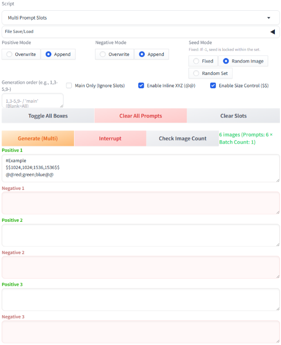

# Multi Prompt Slots for SD WebUI Forge
(The following text is an AI translation of the original Japanese text below.)
## Notes
This extension's script was generated with the assistance of Gemini and Qwen 3.6.

THIS SCRIPT IS PROVIDED "AS IS". IN NO EVENT SHALL THE AUTHOR BE LIABLE FOR ANY CLAIM, DAMAGES OR OTHER LIABILITY ARISING FROM THE USE OF THIS SCRIPT.

This extension was personally developed by a beginner programmer practicing 'vibe coding.' Compatibility with other high-quality extensions is not guaranteed.
No major feature updates or bug fixes are planned for this script. Please note that I do not provide individual support for bug reports, improvement requests, or new feature suggestions.

## Compatibility / Testing Environment
Testing was performed locally on SD WebUI Forge.
Compatibility with other WebUI environments or cloud deployments is untested and not guaranteed.

## Overview
This extension manages up to 30 prompt slots in Stable Diffusion WebUI Forge, enabling batch generation and configuration saving. It is designed for users who find the standard "Prompts from file or textbox" feature cumbersome or prefer a simpler alternative to ComfyUI.

## Main Features
* **30 Prompt Slots:** Generate images with different prompts across multiple slots in batch. You can also generate only selected slots.
* **Inline XYZ:** A simplified X/Y/Z plot function. Specify elements directly in the prompt using `@@tag1;tag2;tag3@@` to cycle through and generate them sequentially.
* **Inline Size Control:** Specify resolution at the beginning of a prompt. Use `$$Width,Height$$` (e.g., `$$1024,512$$`) to set different resolutions per slot.
* **Save/Load Configuration:** Save and restore current slot states as JSON files.

## Installation
1. Open the `Extensions` tab in Forge.
2. Select `Install from URL`.
3. Paste this repository's URL into `URL for extension's git repository`.
4. Click `Install`, then restart the UI (`Apply and restart UI`).

## Uninstallation
Delete the extension's installation folder and restart the UI. You may also delete the `outputs/multi_prompt_configs` folder if needed.

## Usage
After installation and restart, select "Multi Prompt Slots" from the script dropdown menu (where X/Y/Z Plot, etc., are located)

## Limits on Generation Count & Resolution
To reduce the risk of freezing or crashing, the maximum number of images per generation is currently set to 500, and the resolution limit is capped at 2048px. If the calculated count exceeds this limit upon clicking Generate, generation will stop. Resolutions above 2048px are automatically clamped to 2048px. These limits can be modified by changing the constants defined at the top of the script, but increasing them excessively is not recommended. (Performance may vary depending on individual environments and hardware. The author cannot guarantee stable operation or prevent crashes, even within the defined limits.)

## UI Explanation
* **File Save/Load**
  Expands to show save/load controls for prompts.
  **Caution!** Only JSON files created by this extension should be loaded. Do not load standard txt or other JSON formats.

* **Positive/Negative Mode (Positive mode, Negative mode)**
  Choose whether to overwrite or append the main prompt during generation. Overwrite ignores the main prompt; Append adds the slot's prompt after the main prompt.

* **Seed Mode**
  Controls seed values during generation:
  * Fixed: Uses the WebUI Seed value. If set to `-1`, a deterministic batch-specific seed is assigned.
  * Random per Image: Assigns a unique random seed to every image.
  * Random within Set: Keeps seeds fixed within each batch but changes them when switching batches.

* **Target Slots**
  Specifies which slots to generate.
  Examples:
  * Empty: All filled slots.
  * `1,3-5,9-`: Slots 1, 3, 4, 5, and 9 onwards.
  * `main` or `-1`: Ignores slots and generates only using the main prompt.

* **Main Only (Ignore Slots)**
  When checked, ignores slot prompts and uses only the main prompt for generation.

* **Enable Inline XYZ (@@)**
  Toggles the inline XYZ feature on/off. (See details below).

* **Enable Size Control ($$)**
  Toggles the inline size control feature on/off. (See details below).

* **Generate (Multi)**
  Starts generation. Disabled while generating.

* **Interrupt**
  Stops generation. Disabled before starting.

* **Toggle All Boxes**
  Toggle the display/hide of slots 4 and beyond.

* **Clear All Prompts**
  Clears prompts in both the main field and all slots.
  **Caution!** No confirmation dialog appears, so save before clicking to avoid accidental loss.

* **Check Image Count**
  Calculates and displays how many images will be generated based on current conditions (prompts, batch count). Displays yellow for >100, red for >500. Recommended when Inline XYZ or Size Control is enabled. If the count seems off, check for unclosed brackets `@@` or `$$`. Note: Batch size is ignored; only batch count works with this script active.

* **Positive x / Negative x**
  Slots for entering positive and negative prompts.

## Inline XYZ Feature Explanation
Designed to replace the cumbersome Prompt S/R in the standard X/Y/Z Plot, allowing direct entry in prompt boxes. (Note: This is a simplified version without seed control, etc.)

* Enter tags directly in the prompt like `@@tag1;tag2;tag3@@`.
* Multiple instances per prompt are supported, but nested `@@` structures are not. Behavior with wildcards inside `@@` has not been tested.
* If Inline XYZ is disabled during generation, the first tag inside `@@...@@` will be used. Can also be placed in the main prompt field (only works when this script is active).
* The `@@` delimiters are removed from the prompt before image generation.

**Caution!** Adding more `@@...@@` blocks will exponentially increase the number of generated images.

**Examples:**
`@@red;blue;green@@` → Generates 3 images (red, blue, green).
`@@red,blue,green;blue,green,red@@` → Checks the impact of word order via pseudo-permutation.

## Inline Size Control Explanation
While the standard "Prompts from file or textbox" supports size control, it lacks batch multi-size output and has a cumbersome setup. This feature allows direct size specification in prompt boxes.

* Enter sizes in prompts like `$$Width,Height$$`.
* Can be placed in both the main positive prompt field and individual slot fields.
* When in the main prompt, applies to all generated images. When in a slot, applies only to that slot's generation.
* Only one size block per slot is allowed. Nested structures are not supported.
* If multiple blocks exist, the first one takes precedence.
* When placed in slots, images are generated at their respective specified sizes.
* If present in both main and slot fields, the main field's specification takes precedence, ignoring the slot's.
* Use `$$W1,H1;W2,H2$$` to batch generate images at different resolutions.
* The `$$` delimiters are removed before generation.
* Valid range is 64-2048px. Values below 64 clamp to 64, above 2048 clamp to 2048. Non-numeric values revert to the WebUI's default resolution setting.

**Caution!** Adding more `$$...$$` blocks will exponentially increase the number of generated images.

**Examples:**
`$$1024,512$$` → Generates at 1024x512px.
`$$1024,512;512,512;1024,1024$$` → Generates at 1024x512, 512x512, and 1024x1024px.

## Commenting Feature
The standard feature allows `#` comments, but newlines often remain after generation. This script removes lines after `#` and joins remaining text during generation.

* If a prompt contains `#`, everything from `#` to the end of each line is removed, and the remaining text is concatenated.
* Comments can be added to both the main prompt and individual slots.
* When saved, prompts retain comments and newlines for readability.
* Allows arbitrary comments and line breaks, improving prompt readability and management.

## File Save/Load Details
Prompts are saved/loaded in a custom JSON format specific to this extension.

* Click "File Save/Load" to expand the area.
**Loading:**
* Drop the extension's JSON file into the drop zone. To load a different file, click the clear button (×) next to "Load Prompt File".
**Saving:**
* Click "Save Current Settings" to save prompts,target slots and others as a json file. Files are saved to `outputs/multi_prompt_configs` in the Forge directory. To prevent overwriting, filenames are auto-generated with timestamps. (Recommend periodically organizing these files as they accumulate).

**Caution!** Do not attempt to load any files other than the json file generated by this extensions.
If you encounter an error loading the JSON file, clicking 'Clear All Prompts' may resolve the issue. Please try again after doing so.

## Alternative Usage Ideas
**Using Slots as Temporary Prompt Storage:**
Enable "Main Only" to ignore slot prompts. Work in the main prompt field, and when you get a good result, paste it into a slot with comments to save progress. Once you have several ideas saved, click Save, disable "Main Only", set mode to Overwrite, and batch generate all slots at the same seed for comparison. You can then select the best prompts and run multiple batches with random seeds.

## Licence
MIT License

# Multi prompt slots for SD WebUI Forge

## 注意事項
本拡張機能のスクリプトは、Gemini / Qwen3.6との協力により生成されました
本スクリプトは自己責任で使用してください。これによって生じた不具合や損害に作者は一切責任を負いません
本拡張機能は、プログラム経験が皆無な素人がバイブコーディングの練習をかね個人用に開発したものであり、他のすばらしい拡張機能との互換性は保証しません
本スクリプトに今後の大きな機能追加や不具合修正の予定はありません、また個別の不具合、改善要望、機能追加には対応できません

## 動作確認
動作確認は、SD WebUI Forgeでローカル環境で行いました。
他のWebUI環境やクラウドでの動作は未検証のため保証しません。

## 本拡張機能の概要 

この拡張機能は、Stable Diffusion WebUI Forge で最大30個のプロンプトスロットを管理し、一括生成や設定の保存を可能にします
SD Web UIの標準機能の、Prompts from file or textboxは使いにくい、またComfyUIは面倒という人向けです。

## 主な機能 

* 30個のスロット: 複数のスロットに記述された異なるプロンプトの画像を一括で生成できます。また、選択したスロットのみの生成も可能です
* Inline XYZ機能: 簡易的なX/Y/Z機能です。プロンプト中に、@@red;blue;green@@のように記述することで要素を順番に入れ替えて生成します
* Inline Size指定: プロンプトへの記述で画像サイズを指定する機能です。プロンプトの先頭に\$\$Width,Height\$\$(ex. \$\$1024,512\$\$.)と記述することでスロットごとに解像度を指定できます
*設定の保存/読込:現在のスロット状況を JSON ファイルとして保存・復元できます

## インストール方法
1. Forge の \`Extensions\` タブを開きます
2. Install from URL\` を選択します
3. URL for extension's git repository\` にこのリポジトリの URL を貼り付けます
4. Install\` を押し、UIを再起動（Apply and restart UI）してください

## アンインストール方法
本拡張機能のインストールフォルダを削除し、UIを再起動してください (必要に応じてoutputsフォルダに生成される保存フォルダも削除してください)

## 使用方法
インストールおよび再起動後、スクリプトのプルダウン(X/Y/Z Plotなどがあるところ)にMulti Prompt Slotsが追加されているので選択してください

## 生成枚数と解像度の上限
フリーズやクラッシュの危険性をさげるため、現状一回の生成での生成枚数は500枚、解像度は2048pxに上限を設定しています
生成をクリックしたときに上限枚数を超える場合は、生成が停止します
解像度が2048pxを超える場合には、2048pxとなります。
コードの最初に記述している定数により変更は可能ですが、必要以上に大きくすることは推奨しません（マシン性能等個別の環境によるので、現状の上限範囲内でクラッシュしないとは保証できません）

## UIの説明
* ファイルの保存/読み込み(File Save/Load)
  プロンプトを保存/読み込みする場所です
  クリックすると展開します
  **Caution!**
  本機能では本機能向け書式のjson形式ファイルで、データを保存/読み込みします
  通常のtxtファイルや他書式のjsonファイルは読み込ませないでください

* ポジティブ･モード, ネガティブ･モード(Positive mode, Negative mode)
   生成時に、メインのプロンプト欄に記述されているプロンプトに対して、上書きするか、追加するかを選択します
   上書きの場合は、生成時にメイン欄のプロンプトは無視され、追加の場合はメイン欄のプロンプトの後ろに、slotのプロンプトが追加されます

* シード･モード(Seed mode)
　生成時のシード値について選択します
　固定: WebUI本体のSeed値欄に記入されたSeed値で固定します。-1の場合はバッチ単位で固定される決定論的シードが割り当てられます
　画像ごとランダム: すべての画像に異なるSeed値を付与して生成します
　セット内共通ランダム:バッチ内はSeed値を固定し、バッチ切り替わり時に新たなSeed値を付与して生成します

* 生成対象スロット(Target Slots)
    どのスロットを生成するか指定します
　記入例:
　空欄:記入のある全スロット
    1,3-5,9-:1,3,4,5,9以降を生成
　mainまたは-1: slotを無視してメイン欄のプロンプトのみで生成

* Mainのみ生成(スロット無視) (Main Only (Ignore Slots))
　チェックするとslotの記述を無視してメインのプロンプトのみで生成

* Inline XYZ (@@) を有効化(Enable Inline XYZ (@@))
    チェックするとInline XYZを有効化(詳細は下記)

* サイズ指定(\$\$)を有効化(Enable Size Control(\$\$))
    チェックするとサイズ指定(\$\$)を有効化(詳細は下記)
   
* 生成(Multi) (Generate (Multi))
　クリックすると生成開始。生成中はグレーアウト

* 中断(Interrupt)
　クリックすると生成中断。生成前はグレーアウト

* 全ボックスの表示切替
　クリックすると、4以降のslotの表示/非表示を切り替え

* 全プロンプトをクリア
　クリックすると、メイン及び全スロットのプロンプトをクリア
　**Caution!**
   確認画面などは出ないので誤クリックに注意。クリック前にプロンプトの保存を推奨。

* 事前に枚数を確認
   クリックすると現在の条件(プロンプト、バッチ回数)で何枚生成されるか計算して表示(100枚以上で黄色表示、500枚以上で赤色表示)
   Inline XYZおよびサイズ指定有効化時には事前枚数チェックを推奨します。
   (想定よりも多いもしくは少ない場合、囲み文字の閉め忘れ等プロンプトのどこかに間違いがある可能性があります。本スクリプト有効時、バッチ回数は機能しますが、バッチサイズは機能しません。)

* Positive x/Negative x
  Positive prompとNegative promptを入力するSlotです

  ## Inline XYZ機能の説明

  標準のX/Y/Z plotでPrompt S/Rが使いにくいので、プロンプトボックスに直接記述できるようにしました(Seed値などは指定できない簡易版です)

* プロンプト中に@@tag1;tag2;tag3@@のように記入します
* プロンプト中に複数配置可能ですが、 @@の入れ子構造には対応していません。@@中にワイルドカードを配置した場合の挙動については検証していません
* @@…@@を含むプロンプトで、Inline XYZを無効化して生成すると、@@内の最初のtagが使用されます
  メインのプロンプト欄にも配置可能です(本スクリプトが有効でないときには機能しません)
* 画像生成時にプロンプトから@@は除去されます

  **Caution!**
  @@…@@を増やすと乗算的に生成枚数が増大するため注意してください。

  **記入例:**
  @@red;blue;green@@ → red、blue、greenの3枚の画像を生成
  @@red,blue,green;blue,green,red@@ → 疑似的な語順入れ替えにより語順の影響を確認

## Inline Size指定機能の説明

標準機能のPrompts from file or textboxでもサイズ指定はできますが、複数サイズの一括出力などには対応しておらず、また指定方法も面倒だったのでプロンプトボックスで直接サイズ指定できるようにしました

* プロンプトに\$\$Width,Height\$\$のように記入します
* メインのポジティブプロンプト欄と各Slotのポジティブプロンプト欄両方に配置できます
* メインプロンプトに記述された際には、生成されるすべてに適用されます。各Slotに記述された際には、そのslotの生成に適用されます。
* 同一のslotに、2つ以上の配置はできません。また入れ子構造には対応していません。
* 2つ以上配置されているときは、前方の指定が優先されます。
* 各Slotに配置したときには、各々指定されたサイズで画像が生成されます。
* メインのプロンプト欄とslotの両方に配置された際には、メインのプロンプト欄の記述が優先され、slotの記述は無視されます
* \$\$Width1,Height1;Width2,Height2\$\$のように記述すると、異なる画像サイズの画像が一括で生成されます。
* 画像生成時にプロンプトから\$\$は除去されます
* 指定可能範囲は64~2048pxです。下限値以下の指定は64に、上限値以上の指定は2048になります。数値以外の場合、WebUIの設定解像度に戻ります。
 
  **Caution!**
  \$\$…\$\$を増やすと乗算的に生成枚数が増大するため注意してください。

**記入例:**
\$\$1024,512\$\$ → 1024x512pxの画像が生成されます。
\$\$1024,512;512,512;1024,1024\$\$ → 1024x512,512x512,1024x1024で生成されます。

## プロンプトへのコメントアウト機能について
標準機能でも#でコメントアウトできますが、生成時にプロンプトの改行が残ってしまいます。コメントをつけて改行しても、生成時には除去され、結合されるようにしました

* 改行を含むプロンプトに#を含む場合、各行の#以降と改行が除去され、結合されたプロンプトで画像が生成されます
* コメントは、メインプロンプトと各Slotに記入可能です
* プロンプト保存時には、コメント、改行付きで保存されます
* プロンプトに任意コメントが付けられ、また改行を入れられるため、プロンプトの可読性と管理性が向上します

## ファイルの保存と読み込み
本機能で作成されたプロンプトは、独自フォーマットのjsonファイルで保存/読み込みされます

* ファイルの保存・読み込みをクリックするとファイル保存/読み込み領域が展開します
**読み込み**
* 本拡張機能で保存されたjsonファイルを”ここにファイルをドロップ"にドロップすると読み込まれます
* 別のファイルを読み込みたい際には、"プロンプトファイルを読み込む"の横に表示されるクリアボタン(×ボタン)をクリックすると再読み込みが可能となります
**保存**
* 現在の設定を保存をクリックすると、プロンプトと生成対象スロットなどの設定がjsonファイルに保存されます
* ファイルは、Forgeがインストールされているフォルダのoutputs\multi_prompt_configsに保存されます
* プロンプトの上書き保存を防ぐため、保存の際にはファイル名は自動付与され、新規にファイルが作成されます
  (作業が長くなると保存ファイルが増えていくので定期的に整理することを推奨します)

**Caution!**
本機能で生成されたJsonファイル以外のファイルを読み込ませようとしないで下さい。
JSONファイルの読み込み時にエラーが発生した場合は、一度『全プロンプトをクリア』を押してから再度試してください。

## 一括生成以外の使い方案
**slotのプロンプト一時保存領域としての利用**
Mainのみ生成をチェックして有効化しておくと、各slotの記述は無視されます。これを利用してメインのプロンプト欄で作業をし、いい感じのプロンプトになったらプロンプト案としてSlotにそれをペーストして、途中経過を退避させコメントをつけておく。そしてプロンプト案がたまってきたら、一度保存して、mainのみのチェックを外してモードを上書きにし、プロンプト案を同一シードで一括生成して比較。さらに良好なプロンプトのみいくつか選んで、シードを変えながらで複数バッチ生成、というような使い方もできるかもしれません。

## Licence
MIT License

